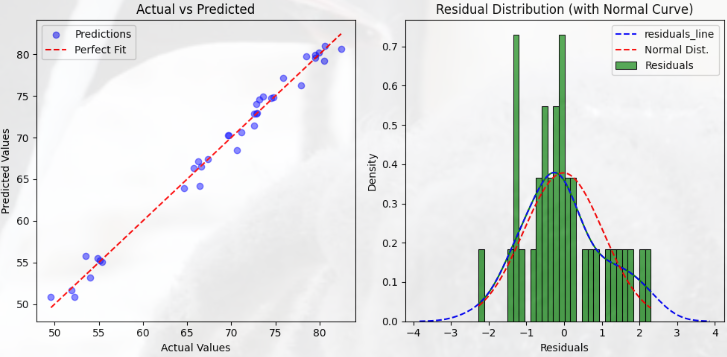
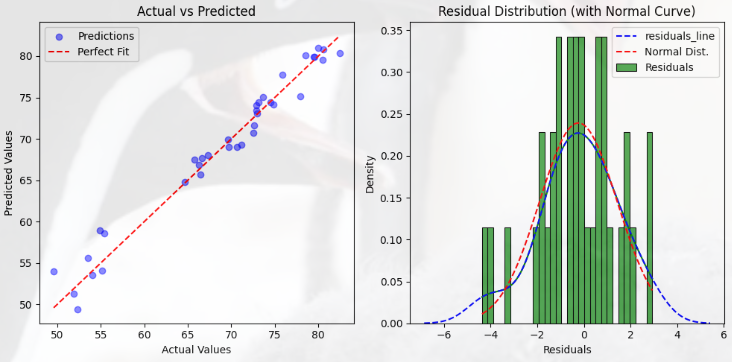

# [SKN09-ML-5Team]
✅ SKN AI FAMILY CAMP 9기<br>
✅ 개발 기간: 2025.01.24 - 2025. 02.03

---

# 💗팀 소개
### 🎃팀명: 생명의 방정식 🍀<br>
### 🐱팀원

| 이름      | GitHub ID                          |
|-----------|------------------------------------|
| 🧑‍💻 박유진  | [@YUJINDL01](https://github.com/YUJINDL01) |
| 👩‍💻 이다인  | [@daainn](https://github.com/daainn)        |
| 👩‍💻 이재혁  | [@ohdyo](https://github.com/ohdyo)          |
| 👨‍💻 최재동  | [@Monkakaka](https://github.com/Monkakaka) |


<br>


---

# 💗 **기술 스택**  

| **분류**         | **기술/도구**                                                                            |
|------------------|------------------------------------------------------------------------------------------|
| **언어**         |      |
| **라이브러리**   |             |
| **협업 툴**      |              |

<br>

---

# 💗프로젝트 개요
### 프로젝트명
- 기대수명 예측 모델 

### 프로젝트 배경
<div align="center">
  
</div>

[Click here for more information](https://www.yna.co.kr/view/AKR20240806040000017)

### 프로젝트 목표
- 머신러닝의 모델을 활용하여 기대수명 예측하는 모델을 개발하는 것을 목표로 한다.
이를 위해 채택한 데이터셋을 전처리하고 여러 모델을 비교및 분석하여 최적의 성능을 보이는 모델 선정한다.
- 이렇게 학습한 모델의 평균지표와 실제 예측의 실효성을 높이는 과정을 보여주는것을 목적으로 한다.

<br>

---

# 💗Machine Learning
## ✅ML 진행 절차
### 1. 데이터셋 개요<br>
* 해당 데이터셋은 다양한 국가의 평균 수명에 영향을 미치는 데이터를 통합한 것으로, 사회경제적 요인과 건강 관련 지표도 함께 제공한다.
**데이터 출처**
[](https://www.kaggle.com/datasets/shreyasg23/life-expectancy-averaged-dataset/code)
<br>

### 2. 데이터 전처리


---

### 3. 사용한 모델
#### ***1. 선형 회귀 모델 (Linear Regressor)***

<code>li_reg = LinearRegression()</code>


##### 모델 학습
<code>li_reg.fit(X_train_scaled,y_train)</code>


##### 성능 평가
```python
y_pred = li_reg.predict(X_test_scaled)
evaluataion(y_test,y_pred)
```
```plainText
mse:  1.1144170028882203
rmse:  1.0556595108690208
mae:  0.8211173801618119
msle:  0.0002498726333569981
rmsle:  0.015807360100820064
r2_score:  0.9875885250502774
```


##### 실제 예측 결과
- 실제 값을 가지고 학습한 모델이 예측하는 값을 파악하기 위해 2007년 해당 컬럼에 대한 데이터를 하나의 나라에서 추출해왔음
- 실제 기대 수명 평균은 79.16
<code>input_predict(li_reg)</code>
<code>82.25581385</code>

##### 피드백 
- 선형 모델을 학습한 결과 msle, rmsle가 0에 수렴하고 $r^2$가 0.95면 데이터 패턴을 잘 학습했다 평가 가능
- mse, rmse, mae 모두 나쁘지 않은 수치를 보여주고 있어 선형 회귀 모델만 사용해도 충분할것 같다는 생각
- 하지만 실측값을 통해 예측해본 결과 기대보다 원하는 값에 미치지 못함

**다른 모델 XGBoost의 회귀 모델을 사용하여 학습 및 평가해볼 예정**

---

#### ***2. XGBRegressor***

##### 모델 학습
- XGBoost는 수치보다 관계가 중요한 모델이기에 표준화를 적용하지 않은 데이터로 훈련
<code>xgb_reg.fit(X_train,y_train)</code>

##### 성능 평가
```python
param_grid = {
    'n_estimators': [100, 200,300,500],
    'learning_rate': [0.01, 0.1, 0.2,0.05],
    'max_depth': [3, 5, 7],
    'subsample': [0.5,0.8, 1.0]
}
xgb_reg = XGBRegressor()
grid_search = GridSearchCV(xgb_reg, param_grid, cv=5,verbose=1, n_jobs=1,scoring='r2')
grid_search.fit(X_train_final,y_train)

y_pred = xgb_reg.predict(X_test_final)
evaluataion(y_test,y_pred)
```
```plainText
mse:  2.837227591729768
rmse:  1.6844071929702058
mae:  1.3110556284586588
msle:  0.0007623976909893691
rmsle:  0.027611549956302148
r2_score:  0.9684012545661528
```


##### 실제 예측 결과
<code>input_predict(xgb_reg)</code>
<code>78.765236</code>

##### 피드백 
- 평가 값은 선형 회귀 모델에 비해 떨어지는걸 확인 가능하다. (그럼에도 여전히 좋은 평가 수치라 판단 가능)
- 하지만 반대로 실측값을 통한 예측은 오히려 더 오차 범위가 줄어든것을 확인할 수 있었다.
  - 예측되는 이유
    1. 과적합
    2. 비선형성 데이터 모델
  - XGBoost회귀모델이 선형 회귀 모델보다 예측값이 실측값에 더 가까운 이유는 평가 점수는 전체적인 성능을 보여주지만, 실제 예측 결과에서는 모델이 데이터를 얼마나 잘 학습했는지가 더 중요하다.
  - XGBoost는 오차가 적고 복잡한 관계를 잘 처리하기 때문에 실제 예측에서 더 좋은 결과를 낼 수 있다.

---


### 5. 프로젝트 기대 효과
- 기존의 경험적 추론에 의존하지 않고, 데이터 기반으로 보다 신뢰성 높은 예측을 제공
- 국가별로 기대수명이 예측되면, 보건 정책 수립에 있어 중요한 참고자료로 이용 가능
- 경제적 요소와 보건적 요소가 기대수명에 미치는 관계를 시각화하여 보건과 경제 발전이 기대수명에 미치는 영향을 평가


