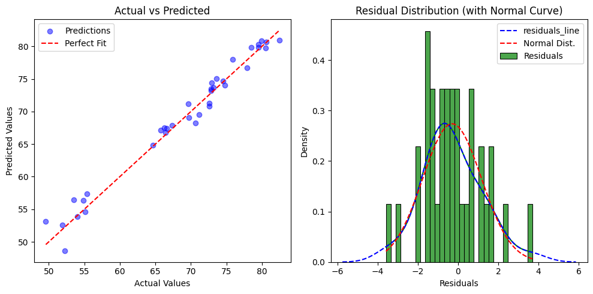
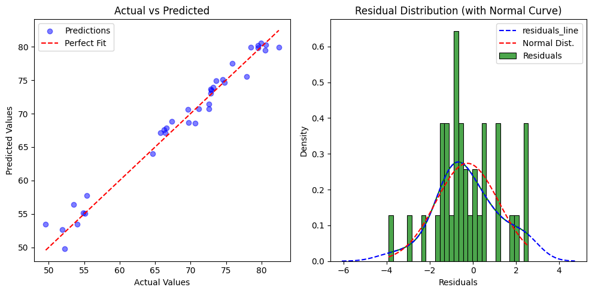
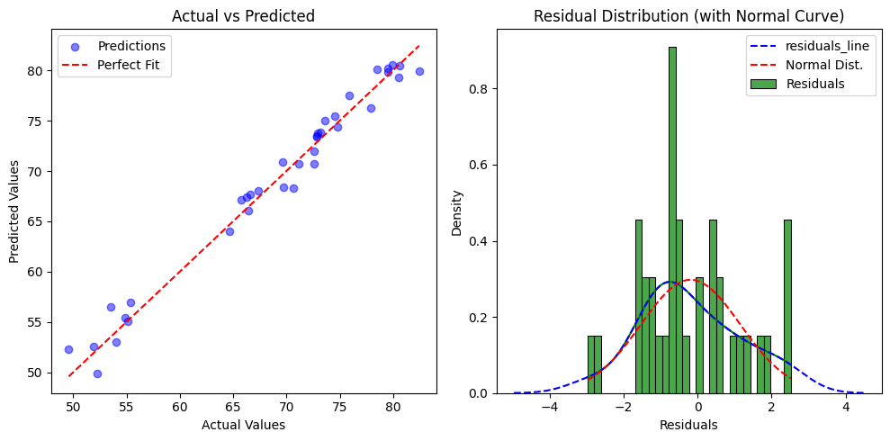
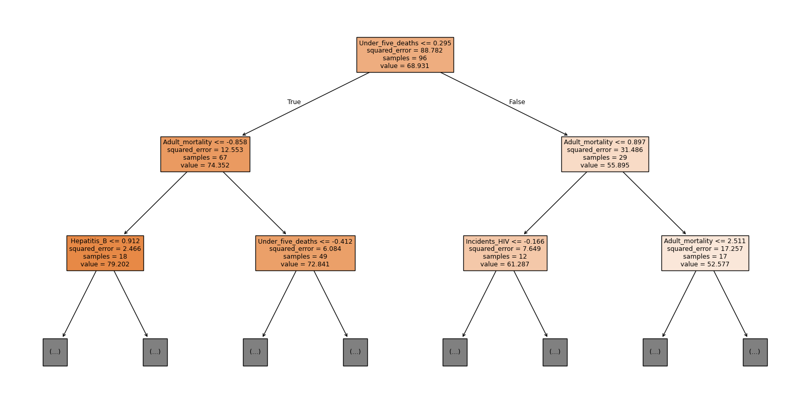
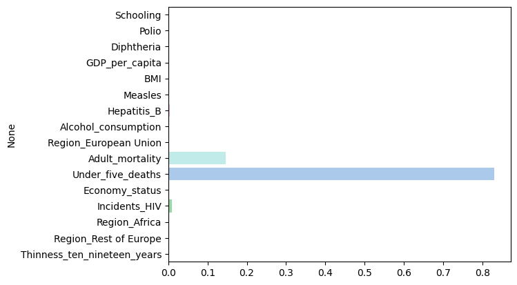

# [SKN09-ML-5Team]
✅ SKN AI FAMILY CAMP 9기<br>
✅ 개발 기간: 2025.01.24 - 2025. 02.03

---

# 💗Team Introduce
### 🎃팀명: 생명의 방정식 🍀<br>
### 🐱팀원

| 이름      | GitHub ID                          |
|-----------|------------------------------------|
| 🧑‍💻 박유진  | [@YUJINDL01](https://github.com/YUJINDL01) |
| 👩‍💻 이다인  | [@daainn](https://github.com/daainn)        |
| 👩‍💻 이재혁  | [@ohdyo](https://github.com/ohdyo)          |
| 👨‍💻 최재동  | [@Monkakaka](https://github.com/Monkakaka) |


<br>


---

# 💗 **Tech Stack**  

| **분류**         | **기술/도구**                                                                            |
|------------------|------------------------------------------------------------------------------------------|
| **언어**         |      |
| **라이브러리**   |             |
| **협업 툴**      |              |

<br>

---
# 💗Contents
### 1. 프로젝트 개요
- 프로젝트명
- 프로젝트 배경
- 프로젝트 목표

### 2. ML 절차
- **데이터셋 개요**
- **피드백 전**
  - 전처리
  - 모델 학습 및 평가
- **피드백 후**
  - 전처리
  - 모델 학습 및 평가
- **최종 피드백 및 모델 선택**
 
### 3. 프로젝트 기대효과

---

# 💗Project Overview
### 프로젝트명
**Predicting Life Expectancy**

### 프로젝트 배경
<div align="center">
  
</div>

[Click here for more information](https://www.hankyung.com/article/2024081677641)

* 보고서에 따르면 2070년 기대수명이 90세까지 증가할 것으로 예상되며, 2050년부터 국민연금 수급자가 가입자를 초과하는 현상이 발생한다.

* 연금 기금 고갈 문제를 해결하기 위해 자동안정화장치와 같은 정책적 대안이 논의되고 있으나, 이러한 정책의 효과를 사전에 분석하고 준비하기 위해서는 **정확한 기대수명 예측이 필수적이다.**
  
* 정확한 기대수명 예측은 기대수명 변화에 따른 연금 지급액 조정, 보험료율 조정 등의 정책 설계를 위한 근거 자료로 활용될 수 있다.

### 프로젝트 목표
- 머신러닝의 모델을 활용하여 기대수명 예측하는 모델을 개발하는 것을 목표로 한다.
이를 위해 채택한 데이터셋을 전처리하고 여러 모델을 비교및 분석하여 최적의 성능을 보이는 모델 선정한다.
- 이렇게 학습한 모델의 평균지표와 실제 예측의 실효성을 높이는 과정을 보여주는것을 목표로 한다.

<br>

---

# 💗Machine Learning
## ✅Dataset Overview <br>
* 해당 데이터셋은 다양한 국가의 평균 수명에 영향을 미치는 데이터를 통합한 것으로, 사회경제적 요인과 건강 관련 지표도 함께 제공한다.
**데이터 출처**
[](https://www.kaggle.com/datasets/shreyasg23/life-expectancy-averaged-dataset/code)
<br>


<table>
  <tr>
    <td>


| 변수명 | 데이터 타입 | 설명 |
|--------|------------|------|
| **분석 타겟 컬럼** | | |
| `Life_expectancy` | float | 기대수명 |
| **유아, 청소년 관련 변수** | | |
| `Infant_deaths` | float | 영아 사망 수 |
| `Under_five_deaths` | float | 5세 이하 사망 수 |
| `Polio` | float | 소아마비 예방접종률 |
| `Thinness_five_nine_years` | float | 5-9세 저체중 비율 |
| `Thinness_ten_nineteen_years` | float | 10-19세 저체중 비율 |
| **건강 관련 변수** | | |
| `Diphtheria` | float | 디프테리아 예방접종률 |
| `Incidents_HIV` | float | HIV 발생 건수 |
| `Hepatitis_B` | float | B형 간염 예방접종률 |
| `Measles` | float | 홍역 사례 수 |
   </td>
   <td>

| 변수명 | 데이터 타입 | 설명 |
|--------|------------|------|
| **경제적 사회적 요인 변수** | | |
| `Country` | object | 국가명 |
| `Region` | object | 지역명 |
| `GDP_per_capita` | float | 1인당 GDP |
| `Population_mln` | float | 인구 (백만 명 단위) |
| **생활 수준 및 습관 관련 변수** | | |
| `BMI` | float | 평균 BMI(체질량지수) |
| `Schooling` | float | 평균 교육 연수 |
| `Economy_status` | object | 경제 상태 |
| `Alcohol_consumption` | float | 1인당 알코올 소비량 |
| `Adult_mortality` | float | 성인 사망률 |

   </td>
  </tr>
</table>

---

## ☑️Before Feedback

###  🔎Data Preprocessing
- **기본적인 데이터 전처리 진행**
- 영향이 적을것 같은 데이터 임의로 제거
  - 나라명, 대륙명, 연도 제거
    
    <code>columns_to_drop = ['Country', 'Region', 'Year']</code>

    <code>data = data.drop(columns=columns_to_drop)</code>

- 경제 상태(=econmy_status)의 경우 1(=좋음) 과 0(=나쁨)으로 나누는 레벨 데이터이기에 표준화(=StandardScaler)사용 없이 진행
- 훈련 데이터 & 테스트 데이터 정규화

    <code>X_train_scaled = scaler.fit_transform(X_train)</code>

    <code>X_test_scaled = scaler.transform(X_test)</code>

### 🔎Model Training and Evaluation
#### ***1. 선형 회귀 모델 (Linear Regressor)***

<code>li_reg = LinearRegression()</code>


##### 모델 학습
<code>li_reg.fit(X_train_scaled,y_train)</code>


##### 성능 평가
```python
y_pred = li_reg.predict(X_test_scaled)
evaluataion(y_test,y_pred)
```
```plainText
mse:  1.1144170028882203
rmse:  1.0556595108690208
mae:  0.8211173801618119
msle:  0.0002498726333569981
rmsle:  0.015807360100820064
r2_score:  0.9875885250502774
```
##### 실제 예측 결과
- 실제 값을 가지고 학습한 모델이 예측하는 값을 파악하기 위해 2007년 해당 컬럼에 대한 데이터를 하나의 나라에서 추출해왔음
- 실제 기대 수명 평균은 79.16
<code>input_predict(li_reg)</code>
<code>82.25581385</code>

##### 피드백 
- 선형 모델을 학습한 결과 msle, rmsle가 0에 수렴하고 $r^2$가 0.95면 데이터 패턴을 잘 학습했다 평가 가능
- mse, rmse, mae 모두 나쁘지 않은 수치를 보여주고 있어 선형 회귀 모델만 사용해도 충분할것 같다는 생각
- 하지만 실측값을 통해 예측해본 결과 기대보다 원하는 값에 미치지 못함

**선형 회귀 모델을 바탕으로 다른 모델 XGBoost의 회귀 모델을 사용하여 학습 및 평가해볼 예정**


#### ***2. XGBRegressor***

##### 모델 학습
- XGBoost는 수치보다 관계가 중요한 모델이기에 표준화를 적용하지 않은 데이터로 훈련
<code>xgb_reg.fit(X_train,y_train)</code>

##### 성능 평가
```python
param_grid = {
    'n_estimators': [100, 200,300,500],
    'learning_rate': [0.01, 0.1, 0.2,0.05],
    'max_depth': [3, 5, 7],
    'subsample': [0.5,0.8, 1.0]
}
xgb_reg = XGBRegressor()
grid_search = GridSearchCV(xgb_reg, param_grid, cv=5,verbose=1, n_jobs=1,scoring='r2')
grid_search.fit(X_train,y_train)

y_pred = xgb_reg.predict(X_test_final)
evaluataion(y_test,y_pred)
```
```plainText
mse:  2.837227591729768
rmse:  1.6844071929702058
mae:  1.3110556284586588
msle:  0.0007623976909893691
rmsle:  0.027611549956302148
r2_score:  0.9684012545661528
```

##### 실제 예측 결과
<code>input_predict(xgb_reg)</code>
<code>78.765236</code>

##### 피드백 
- 평가 값은 선형 회귀 모델에 비해 떨어지는걸 확인 가능하다. (그럼에도 여전히 좋은 평가 수치라 판단 가능)
- 하지만 반대로 실측값을 통한 예측은 오히려 더 오차 범위가 줄어든것을 확인할 수 있었다.
  - 예측되는 가설
    1. 확실한 데이터 전처리
    2. 비선형성 데이터 모델
  - 선형 모델은 평가지표에 해당하는 수치를 최소화하는 방식으로 학습하고 데이터 간 비선형 데이터가 존재할수 있기에 더 자세하게 데이터를 분석하고 학습을 위한 훈련 데이터로서 처리하는 방식으로 다시 모델을 학습시킬 계획이다.

---
## ✅After Feedback
### 🔎Data Preprocessing
##### Encoding
* 범주형 변수인 `Region`, `Country`에 한하여 인코딩 적용
  * `Region`에 대해 원-핫 인코딩 적용 
  ```python
  pd.get_dummies(df['Region'], prefix='Region')
  ```
  * `Country`에 대해 라벨 인코딩 적용 
  ```python

  label_encoder = LabelEncoder()
  df['Country_encoded'] = label_encoder.fit_transform(df['Country'])
  ```
  >`Country` 컬럼에 원-핫 인코딩 적용시 차원수가 급격히 증가하기에 라벨 인코딩 선택

##### Correlation Analysis & Feature Selection
* 기대수명과 수치형 변수간의 상관계수 계산
`corr_matrix = numeric_df.corr()`

<div align="center">
  
</div>

* 기대수명과 0.4 이상의 상관관계가 존재하는 변수만 선택

##### Multicollinearity Removal
* 설명변수들 간에 높은 상관관계가 있을 경우 다중공선성(Multicollinearity, 설명변수 간의 강한 상관관계) 문제 발생 가능. 
  * 이를 해결하기 위해 VIF(Variance Inflation Factor) 점수를 확인하여, 높은 점수를 가진 변수를 선택적으로 제거.

| Variable                      | VIF           |  Variable                      | VIF           |
|-------------------------------|---------------|-------------------------------|---------------|
| Year                           | 5979.413761   |Incidents_HIV                  | 2.914893      |
| Infant_deaths                  | 51.545600     | GDP_per_capita                 | 2.571161      |
| Under_five_deaths              | 61.300625     | Population_mln                 | 1.190803      |
| Adult_mortality                | 27.191129     | Thinness_ten_nineteen_years    | 40.783668     |
| Alcohol_consumption            | 2.708740      | Thinness_five_nine_years       | 40.943215     |
| Hepatitis_B                    | 4.133808      | Schooling                      | 5.023130      |
| Measles                        | 1.867686      | Economy_status                 | 3.071527      |
| BMI                            | 2.978077      | Life_expectancy                | 59.579734     |
| Polio                          | 24.151475     | Country_encoded                | 1.064154      |
| Diphtheria                     | 26.706093     |


* VIF점수 확인을 통해 제거한 변수는 다음과 같다.
* Year, Infant_deaths, Thinness_five_nine_years


##### Scailing
```python
scaler = StandardScaler()
X_train_scaled = scaler.fit_transform(X_train)
X_test_scaled = scaler.transform(X_test)
```
* `StandardScaler() 적용`

### 🔎Model Training and Evaluation
>모든 모델은 `GridSearchCV`를 활용하여 최적의 하이퍼파라미터를 찾은 후 학습을 진행.
#### *1. LinearRegressor*
<code>lr_model.fit(X_train_scaled, y_train)</code>

##### 성능 평가

<code>evaluataion(y_test, y_pred_lr)</code>

```explain Text
mse:  1.101358232840826
rmse:  1.049456160514019
mae:  0.826333845987011
msle:  0.00025358165738405405
rmsle:  0.01592424746680527
r2_score:  0.9877339630657576
```


##### 예측 결과
<code>korea_pred(lr_model)</code>
```explain Text
예측값: 82.27684908076387
실제값: 79.16
예측 오차: 3.1168490807638705
```

##### 피드백
- 선형회귀 모델은 평가 지표에선 뛰어난 성능을 보이는 반면 예측값에선 큰 오차 범위를 보여주고 있다.
- 아까와 같이 선형 모델에서 이런건지 다른 모델을 학습해보면서 확인해볼 예정이다.

#### *2. XGBoost Regressor*

`xgb_model = xgb.XGBRegressor(random_state=42)`

##### 모델 평가
```plainText
mse:  2.2109802051878247
rmse:  1.4869365168654056
mae:  1.192643631829156
msle:  0.0006018966592717637
rmsle:  0.024533582275561874
r2_score:  0.9753758912867433
```


##### 예측 결과
<code>korea_pred(xgb_model)</code>
```plain Text
예측값: 76.37752532958984
실제값: 79.16
예측 오차: 2.782474670410153
```

##### 피드백
- XGBoost 모델은 평가 지표에선 기본 선형회귀보다 낮은 성능을 보이는 반면 예측값에선 적은 오차 범위를 보여주고 있다.
- 전처리를 하기 전과 비교해보았을 때는 나은 성능을 보이는 것을 확인된다.


#### *3. Random Forest Regressor*
<code>rf_model = RandomForestRegressor(random_state=42)</code>

##### 모델 평가
<code>evaluataion(y_test, y_pred_rf)</code>
```plain Text
mse:  2.194148954074446
rmse:  1.4812659970695492
mae:  1.19654427083334
msle:  0.0005621200999806988
rmsle:  0.02370907210290396
r2_score:  0.9755633441441789
```



##### 예측 결과
<code>korea_pred(rf_model)</code>
```plain Text
예측값: 79.0389687500001
실제값: 79.16
예측 오차: 0.121031249999902
```

##### 피드백
- Random Forest 모델 또한 평가 지표상에선 기본 선형회귀보다 낮은 성능을 보이는 반면 실제 예측 오차는 0.1로 가장 적은 오차 범위를 보여주고 있다.

#### *4. VotingRegressor*
* `RandomForestRegressor`와 `GradientBoostingRegressor` 모델을 학습시킨 후, `VotingRegressor를` 사용하여 앙상블을 수행

```python
voting_model = VotingRegressor([
    ('rf', rf_model), 
    ('gb', gb_model)
])
voting_model.fit(X_train, y_train)
```

##### 모델 평가
<code>evaluataion(y_test, y_pred_voting)</code>
```plain Text
mse:  1.8331477334836315
rmse:  1.3539378617512812
mae:  1.132672489638757
msle:  0.00045020182523947946
rmsle:  0.021217959968844305
r2_score:  0.9795838836680465
```



##### 예측 결과
<code>korea_pred(voting_model)</code>
```plain Text
예측값: 79.32571002793755
실제값: 79.16
예측 오차: 0.16571002793754985
```

##### 피드백
* 단일 Random Forest 모델보다 평가 지표상 성능이 더 좋아 보이지만, 실제 예측 오차는 오히려 더 크게 나타난다.

## ✅ 최종 피드백 및 모델 선정

- 현재 단일 랜덤포레스트와 다른 앙상블 모델을 비교했을 때 실제 성능 차이가 유의미하게 나지 않는다. 
- 단일 모델만 사용하는것이 메모리 사용량이 적고 예측속도 또한 차이가 있기에 우리가 이 프로젝트를 위해 최종적으로 사용할 모델은 랜덤포레스트가 적합하다 판단하였다. 

**Random Forest Regressor 학습 결과**
<div style="display: flex; justify-content: center; align-items: center;">
    
    
</div>

* `Random Forest Regressor`를 통해 학습한 결과, 가장 큰 영향을 미친 변수는 `Under_five_deaths`(5세 미만 사망률)였으며, 성인 사망률도 일정 부분 영향을 미친 것으로 나타났다. 
* 그 외 변수들은 큰 영향을 미친 것으로 보이지 않지만, 그 중에서 `Incidents_HIV`(HIV 발생률)는 비교적 미미한 영향을 끼친 것으로 확인되었다.

---


# 💗 프로젝트 기대 효과
- 본 프로젝트에서는 기존의 경험적 추론에 의존하지 않고, 데이터 기반으로 보다 신뢰성 높은 예측을 제공

- 추후에 본프로젝트에서 더 나아가서 기대수명 증가로 인한 연금 수급자 증가 문제를 예측하고, 국민연금 개혁 및 고령화 사회 대비 정책 수립에 기여할 수 있다.
  >- 연금 지급 시기를 조정하거나 자동안정화장치 등의 정책을 적용하는 근거 자료로 활용 가능.

- 경제적 요소와 보건적 요소가 기대수명에 미치는 관계를 시각화하여 보건과 경제 발전이 기대수명에 미치는 영향을 평가

- 국가 적 차원에서 보았을 때는 국가 간 건강 격차를 수치화하여 국제 기구(WHO, UN 등) 정책 수립 지원 가능
  >- 국가별로 기대수명이 예측되면, 정책 수립에 있어 중요한 참고자료로 이용 가능
  >- 저개발국가의 기대수명 향상을 위한 효과적인 개입 전략 제안 가능


